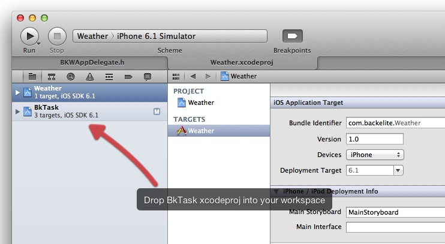
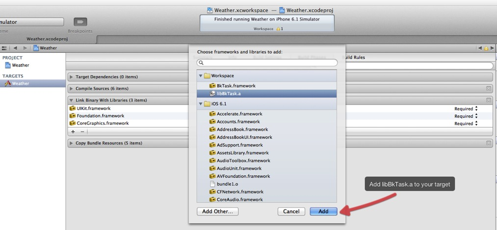
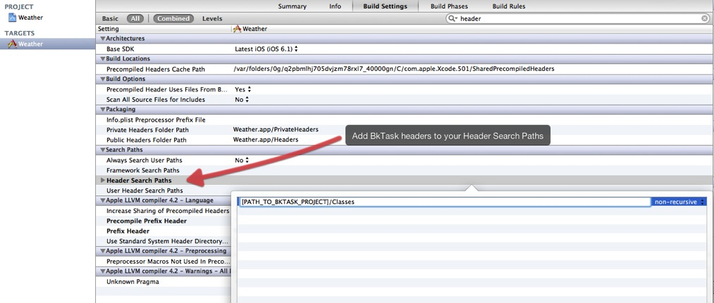

# BkTask
Asynchronous and modular.
Asynchronous => keep the UI Thread for UI.
Modular => Easily change a step in a workflow without breaking everything

NSOperation + KVO

Used in AppStore applications.

## Changes
v 0.6  

* ARC Conversion
* Added Weather sample project
* Code documentation in appledoc format

## Getting started
### Xcode configuration
The simplest way to use BkTask with your project is with Xcode 4 workspaces. Just drag and drop `BkTask.xcodeproj` below your other projects in the workspace.
  

Then, select your project's target and click on the `Build Phases` tab. Unfold the `Link Binary With Libraries` section and click on the + button to add a new library.
Select `libBkTask.a` and click `Add`.  
  

As it is a static library, you will need to indicate the path to BkTask headers. To do so, select your project's target and click on the `Build Settings` tab. Find the `Header Search Paths` and set the path to the `Classes` directory of BkTask.
For instance, let's assume that you have a `Libraries` directory at the same level of your `.xcodeproj` where you store all your external libraries. In that case, the header to indicate would be `$(SRCROOT)/Librairies/BkTask/Classes`.  
  

__To make this step even easier, support for cocoapods is coming soon.__

-------

### Using BkTask

-------

### Sample project

## Requirements
BkTask requires iOS 5.0 and above. If you need iOS 4.3 compatibility, you can exclude the `BkJSONParsingOperation` class of the BkTask target and it should be okay. 
However this tip is not guaranteed to stay true in future releases. 

### ARC
BkTask uses ARC.  
If you are using BkTask in your non-arc project, you will need to set a `-fobjc-arc` compiler flag on all of the BkTask source files.  
To set a compiler flag in Xcode, go to your active target and select the "Build Phases" tab. Now select all BkTask source files, press Enter, insert -fobjc-arc and then "Done" to enable ARC for BkTask.     

If you use Xcode 4 workspaces with BkTask included as a project into your workspace then you don't need any specific configuration related to ARC.

## Licence
BkTask is available under the MIT license. See the LICENSE file for more info.
